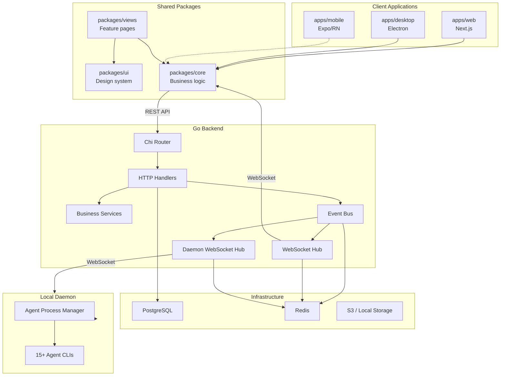

# System Architecture

## Component Layers

**Dependency direction**: `apps/*` → `packages/views` → `packages/core` + `packages/ui`. `packages/core` and `packages/ui` are independent of each other.

## Backend: Go Server

The backend is a Go 1.26 application located in `server/`. Key packages:

| Package | Purpose | Key Files |
|---------|---------|-----------|
| `cmd/server/` | Main API server binary | `main.go`, `router.go` |
| `internal/handler/` | HTTP handlers (~180 files) | `handler.go` (Config + Handler struct), domain files (`agent.go`, `issue.go`, `comment.go`, `daemon.go`, etc.) |
| `internal/service/` | Business logic services | `task.go` (task lifecycle), `issue.go`, `autopilot.go`, `email.go` |
| `internal/events/` | Synchronous pub/sub event bus | In-process dispatch, panic-isolated subscribers |
| `internal/realtime/` | WebSocket hub for web clients | Redis-backed sharded streams (`XADD`/`XREAD`) |
| `internal/daemonws/` | WebSocket hub for daemons | Daemon registration, task dispatch |
| `internal/scheduler/` | Background job scheduler | Autopilot dispatch, task usage rollups |
| `internal/daemon/` | Daemon management (server-side) | Config, auto-update, GC, identity, runtime reconciliation |
| `pkg/db/` | Database layer | `generated/` (sqlc output), `queries/` (40+ SQL files) |
| `pkg/protocol/` | WebSocket wire protocol | Message types, payload structs |
| `pkg/agent/` | Agent runtime adapters | Wraps 15+ CLIs for model detection, version extraction, MCP config |

The `Handler` struct (`server/internal/handler/handler.go`) is the central dependency container — it holds references to the database, WebSocket hubs, event bus, services, caches, and integration clients. It is constructed in `main.go` and wired into the router.

## Event-Driven Architecture

The backend uses an event-driven pattern for side effects:

1. **HTTP handlers** publish domain events to the in-process `events.Bus`
2. **Subscribers** (registered at startup) react to specific event types:
   - `"issue:created"` → notifications, realtime broadcast, autopilot triggers
   - `"comment:posted"` → mention resolution, activity logging
   - `"task:claimed"` → daemon dispatch
3. **Redis streams** fan out events across multiple server processes
4. **WebSocket hubs** broadcast to connected web clients and daemons

This design keeps handlers focused on request/response and isolates side effects in subscribers. Panics in one subscriber do not affect others.

## WebSocket Realtime

Two separate WebSocket hubs serve different client types:

| Hub | Location | Clients | Purpose |
|-----|----------|---------|---------|
| `realtime.Hub` | `server/internal/realtime/` | Web browsers | Real-time issue updates, chat messages, activity |
| `daemonws.Hub` | `server/internal/daemonws/` | Local daemons | Task dispatch, progress streaming, daemon registration |

Both use Redis pub/sub for cross-process fanout so that any server instance can reach clients connected to any other instance.

## Frontend: TypeScript Monorepo

The frontend is organized as a pnpm workspace with Turborepo orchestration. It builds three apps from shared packages.

### Package Boundaries (Hard Rules)

These are enforced constraints documented in `CLAUDE.md`:

| Package | Constraints |
|---------|-------------|
| `packages/core/` | No `react-dom`, no `localStorage` (use `StorageAdapter`), no `process.env`, no UI libraries |
| `packages/ui/` | No `@multica/core` imports, no business logic |
| `packages/views/` | No `next/*`, no `react-router-dom`, no Zustand stores. Use `NavigationAdapter`, `useNavigation()`, `<AppLink>` |
| `apps/web/platform/` | Only place for Next.js navigation/platform APIs |
| `apps/desktop/src/renderer/src/platform/` | Only place for `react-router-dom` navigation |

### State Management

The platform enforces a strict split between server state and client state.

- **TanStack React Query** owns all server state: issues, members, agents, inbox, workspace data. Query keys include `wsId` for workspace scoping.
- **Zustand** owns client/view state: filters, drafts, modals, tab layout. All stores live in `packages/core/`, never in `packages/views/` or app directories.
- **React Context** is for platform plumbing only: `WorkspaceIdProvider`, `NavigationProvider`.
- **WebSocket events** invalidate or patch React Query cache. They never mirror server data into Zustand, except for clearing client-owned pointers (active session, selection) with a single-responder guard.

### API Client

The API client lives at `packages/core/api/client.ts`. Endpoints consumed by UI must pass through Zod schemas (`packages/core/api/schemas.ts`) using `parseWithFallback` to survive backend response drift — critical for installed desktop apps that may talk to newer backends.

## Daemon Model

The daemon is a local process (distributed as the `multica` CLI binary) that:

1. Connects to the server via WebSocket and registers available agent runtimes
2. Auto-discovers installed agent CLIs on the machine
3. Receives task dispatches and manages agent process execution
4. Streams progress (tool calls, output) back to the server
5. Handles repo cloning, workdir preparation, and skill injection

The daemon runs on the developer's machine, not on the server. This means agents execute in the developer's local environment with their actual tools and credentials. The server's `daemonws.Hub` dispatches tasks and receives progress updates over the persistent WebSocket connection.

See [Task Execution Workflow](../workflows/task-execution.md) for the full lifecycle and [Agents and Runtimes](../domain/agents-and-runtimes.md) for agent and daemon configuration details.

## Deployment Modes

| Mode | Description | Key Files |
|------|-------------|-----------|
| **Multica Cloud** | Hosted SaaS with cloud runtimes | `server/internal/cloudruntime/` |
| **Self-Hosted** | Docker Compose deployment with PostgreSQL, Redis, server, web | `docker-compose.selfhost.yml`, `SELF_HOSTING.md` |
| **Local Daemon** | CLI on developer machines, connecting to cloud or self-hosted server | `CLI_AND_DAEMON.md` |
| **Desktop App** | Electron wrapper providing tray icon, auto-start, and system integration | `apps/desktop/` |

## Database

PostgreSQL with `pgvector/pgvector:pg17` for the CI image. Database access is through **sqlc**-generated type-safe Go code:

- SQL queries live in `server/pkg/db/queries/` (organized by domain: `agent.sql`, `issue.sql`, `comment.sql`, `chat.sql`, etc.)
- Generated Go code in `server/pkg/db/generated/`
- Versioned migrations in `server/migrations/` (150+ migration files)
- Regenerate after SQL changes with `make sqlc`
- Migration numbering is sequential; `server/internal/migrations/migrations_lint_test.go` enforces ordering

All queries filter by `workspace_id`; membership gates access; `X-Workspace-ID` header selects the current workspace.
