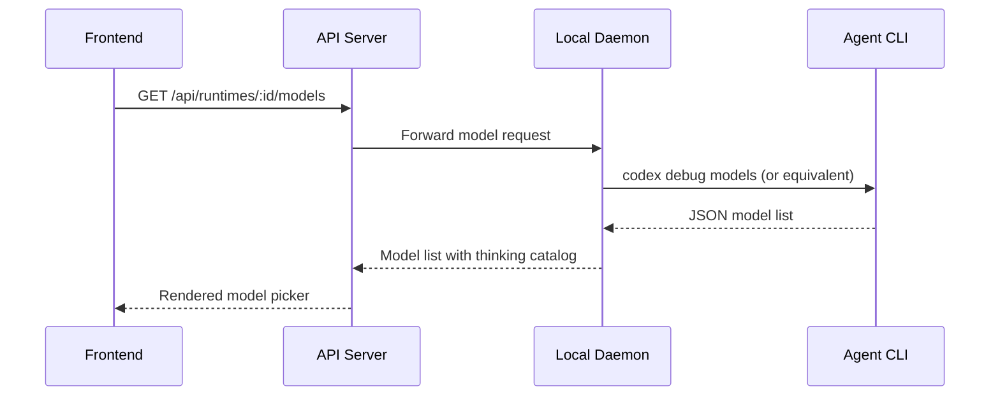

# Agents and Runtimes

Agents are the core abstraction in Multica. They are workspace-scoped rows in the `agent` database table that represent an AI coding agent that can be assigned issues, claim tasks, and execute work on a daemon-managed runtime.

## Agent Model

An agent record contains two distinct text fields, often confused:

| Field | Purpose | Consumed By | Size Limit |
|-------|---------|-------------|------------|
| `description` | Human-facing catalog summary. Shown in listings and profiles. | UI only | 255 Unicode code points |
| `instructions` | Runtime behavior contract. Persona, responsibilities, boundaries, output and escalation rules. | Daemon (injected into agent prompt at claim time) | No hard limit |

The distinction matters: `description` is metadata, `instructions` is what the agent actually runs on. The daemon reads `instructions` at claim time and ships it to the provider as durable system instructions.

Other key fields:

| Field | Purpose |
|-------|---------|
| `name` | Display name (required) |
| `runtime_id` | Which runtime profile to use (required) |
| `model` | Override model ID; empty means "use the runtime's default" |
| `thinking_level` | Reasoning effort level passed to the CLI |
| `custom_args` | Extra CLI arguments appended to the agent command |
| `custom_env` | Encrypted environment variables (gated: owner/admin only) |
| `skills` | Bound skill IDs injected into the prompt at claim time |

Agent creation is a single `POST /api/agents` (or `multica agent create`). The persistent row, not the create response, is what the daemon reads at claim time.

Key code: `server/internal/handler/agent.go` (92KB — the largest handler file), `server/internal/service/builtin_skills/multica-creating-agents/SKILL.md` (authoritative contract).

## Runtime Types

Multica supports 15+ agent CLIs, each with an adapter in `server/pkg/agent/`:

| Runtime | Adapter | Notes |
|---------|---------|-------|
| **Claude Code** | `claude.go` | Anthropic's CLI; model + `--effort` levels; stale resume recovery |
| **Codex** | `codex.go` | OpenAI's CLI; `codex debug models` for dynamic model/reasoning catalog |
| **CodeBuddy** | Individual adapter | Google's coding agent |
| **GitHub Copilot CLI** | `copilot.go` | GitHub's CLI agent |
| **OpenCode** | `opencode.go` | Uses `opencode run --variant` for provider-specific models |
| **Cursor Agent** | `cursor.go` | MCP config seeding from Cursor's config |
| **OpenClaw** | Individual adapter | Open-source agent |
| **Hermes** | Individual adapter | Open-source agent |
| **Pi** | Individual adapter | Open-source agent |
| **Kimi** | `kimi.go` | Moonshot AI agent |
| **Kiro CLI** | Individual adapter | CLI agent |
| **Antigravity** | Individual adapter | CLI agent |
| **Qoder CLI** | Individual adapter | CLI agent |
| **Trae CLI** | Individual adapter | CLI agent |

Each adapter handles: version detection, model list discovery, thinking/reasoning catalog discovery, MCP configuration, and process lifecycle management.

Key code: `server/pkg/agent/models.go`, `server/pkg/agent/thinking.go`, and individual adapter files.

## Dynamic Model Discovery

Models are not hard-coded. The daemon discovers available models by shelling out to each installed CLI:



Results are cached:
- **Model cache**: 60-second TTL (`modelCacheTTL`)
- **Thinking catalog cache**: 10-minute TTL (`thinkingDiscoveryTTL`), keyed on `(provider, executablePath, cliVersion)` so installing a new CLI version invalidates the cache

The `Model` struct carries a `Thinking` field with per-model reasoning levels:

```go
type Model struct {
    ID       string          `json:"id"`
    Label    string          `json:"label"`
    Provider string          `json:"provider,omitempty"`
    Default  bool            `json:"default,omitempty"`
    Thinking *ModelThinking  `json:"thinking,omitempty"`
}
```

## Thinking / Reasoning Levels

Each runtime has its own vocabulary for reasoning effort. These are passed directly to the CLI with no normalization:

| Runtime | Levels | CLI Flag |
|---------|--------|----------|
| Claude Code | `low`, `medium`, `high`, `xhigh`, `max` | `--effort <value>` |
| Codex | `none`, `minimal`, `low`, `medium`, `high`, `xhigh`, `max`, `ultra` | `model_reasoning_effort=<value>` |

The UI renders supported levels as-is so what users see matches each CLI's own interface. OpenCode additionally exposes provider-specific model variants through `opencode run --variant`.

Key code: `server/pkg/agent/thinking.go` — discovery and caching, `server/internal/handler/agent_thinking_test.go`.

## Skill Binding

Agents can have skills bound to them. At claim time, the daemon fetches the skill bundles and injects them into the agent's runtime prompt. Skills are workspace-scoped and can be imported/exported as archives.

Key code: `server/internal/handler/skill.go` (78KB), `server/internal/handler/runtime_local_skills.go`, `server/pkg/skillbundle/`.

## Runtime Profiles

Runtime profiles define how an agent runtime is configured for a workspace. They can be:

- **Built-in**: Standard profiles for each supported agent CLI
- **Custom**: Workspace-specific profiles with custom workdirs, repos, and environment

The daemon registers runtimes for each configured workspace and profile. When a custom profile is created, edited, disabled, or deleted, the server sends a `RuntimeProfilesChanged` WebSocket message to the daemon, which re-fetches profiles and re-registers runtimes.

Key code: `server/internal/handler/runtime_profile.go`, `server/internal/handler/runtime.go`.

## Daemon Registration and Heartbeat

When the daemon connects to the server:

1. Sends `DaemonRegister` with its daemon ID, agent ID, and list of available runtimes
2. Each runtime reports its type, version, and status
3. The server registers the runtimes and begins sending task wakeup hints
4. The daemon sends periodic heartbeats to maintain liveness

The server sweeps stale daemons that miss heartbeats, marking their runtimes offline.

Key code: `server/internal/handler/daemon.go` (141KB — the largest handler), `server/internal/daemon/daemon.go`.

## Security: Custom Environment Variables

Agent `custom_env` fields are encrypted at rest. Only workspace owners and admins can read plaintext values; agents themselves are denied. The `has_custom_env` and `custom_env_key_count` fields are visible to all as metadata without exposing secrets.

## Related Concepts

- [Task Execution Workflow](../workflows/task-execution.md) — how agents claim and execute tasks
- [Architecture Overview](../architecture/overview.md) — how the daemon WebSocket hub fits in
- [Integrations](../integrations/overview.md) — Composio tool connector for agents
