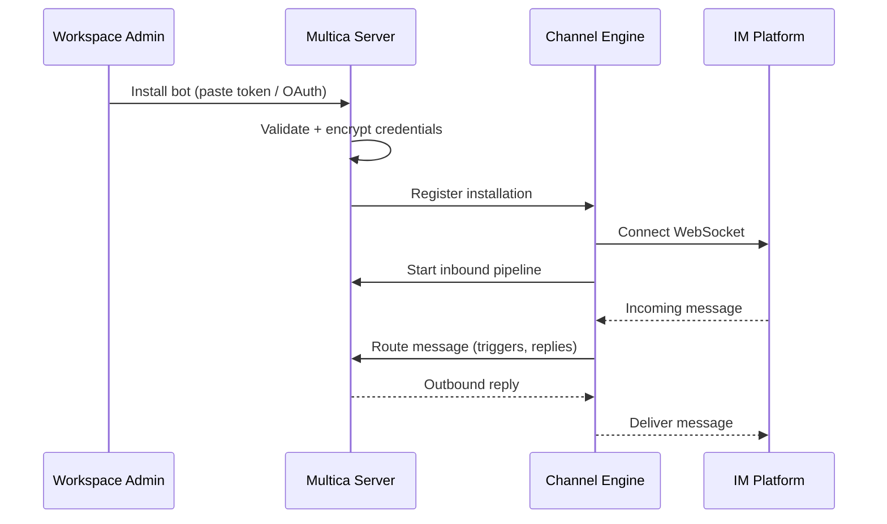

# Integrations

Multica integrates with external platforms for messaging, code hosting, tool access, and automation triggers. All integration code lives under `server/internal/integrations/` with HTTP handlers in `server/internal/handler/`.

## Channel Abstraction

The channel engine (`server/internal/integrations/channel/engine/`) provides a shared abstraction for IM bot integrations:

| Component | Purpose |
|-----------|---------|
| `Supervisor` | Owns per-installation goroutines that hold WebSocket leases and drive each channel |
| `Router` | Channel-agnostic inbound pipeline: debounced run triggers, in-flight reply goroutines |
| `Factory` | Per-platform factory registered at startup (Feishu, Slack) |

The `Supervisor` is started by `main.go` under a long-running context and drained on graceful shutdown. It does NOT depend on any specific Lark/Feishu master key — each platform registers its `Factory` only when configured.

Key code: `server/internal/handler/handler.go` — `ChannelSupervisor` and `ChannelRouter` wiring.

## Slack Integration

Slack integration supports bring-your-own-app (BYO) installation:

- **Install flow**: Users paste a Slack bot token; the server validates, encrypts, and stores it
- **Bot token encryption**: At-rest encryption of bot tokens
- **Channel binding**: Slack channels are bound to Multica workspaces
- **Message delivery**: The bot can post and receive messages in bound channels
- **Orphan reclaim**: Auto-reclaims orphaned IM-bot installations (`ccacce60a`)

Key code: `server/internal/integrations/slack/` (`byo_install.go`, `install.go`), `server/internal/handler/slack.go`.

## Lark / Feishu Integration

Lark (Feishu) integration uses device-flow OAuth:

- **Device-flow install**: `RegistrationService` manages the install lifecycle (begin session, poll, write installation on success)
- **Interactive cards**: `SendInteractiveCard`, `PatchInteractiveCard`, `SendBindingPromptCard`
- **Bot info**: `GetBotInfo` retrieves bot profile
- **Master key**: `MULTICA_LARK_SECRET_KEY` gates the integration; handlers return 503 when unset
- **Binding tokens**: `BindingTokenService` manages user-to-Lark account bindings

Key code: `server/internal/integrations/lark/` (`registration_service.go`, `channel_store.go`, `channel_cleanup_test.go`), `server/internal/handler/lark.go`.

## GitHub Integration

GitHub integration connects repositories to Multica:

- **Repo connection**: Workspaces can connect GitHub repositories
- **PR references**: Agents can reference PRs in comments
- **Webhook handling**: GitHub webhooks trigger workflow updates

Key code: `server/internal/handler/github.go` (59KB), `server/internal/handler/github_test.go` (135KB).

## Composio Integration

Composio provides a tool connector for agents, allowing them to access external services during task execution:

- **API key gated**: `COMPOSIO_API_KEY` env var; handlers return 503 when unset
- **Allowlist management**: Agent-level control over which Composio tools are available
- **Service**: `composio.Service` wired in `cmd/server/router.go`

Key code: `server/internal/integrations/composio/`, `server/internal/handler/integrations_composio.go`, `server/internal/handler/agent_composio_allowlist_test.go`.

## Webhook Delivery

Autopilots can be triggered by incoming webhooks. The webhook delivery system:

- **Endpoint**: `POST /api/webhooks/:id` — receives external HTTP calls
- **Rate limiting**: Per-webhook and per-IP rate limiting (`WebhookRateLimiter`, `WebhookIPRateLimiter`) to prevent abuse
- **Delivery tracking**: `webhook_delivery` table records each delivery attempt
- **Autopilot trigger**: Received webhooks trigger autopilot plan execution

Key code: `server/internal/handler/webhook_delivery.go`, `server/internal/handler/autopilot_webhook.go`, `server/internal/handler/webhook_rate_limiter.go`.

## IM Bot Channel Lifecycle

The channel engine manages the full lifecycle of IM bot installations:

If a bot installation becomes orphaned (workspace deleted, token revoked), the channel engine auto-reclaims it during regular reconciliation (`ccacce60a`).

## Related Concepts

- [Architecture Overview](../architecture/overview.md) — how the channel engine and integrations wire into the Handler
- [Issues and Collaboration](../domain/issues-and-collaboration.md) — how autopilot webhooks create issues
- [Agents and Runtimes](../domain/agents-and-runtimes.md) — how Composio tools extend agent capabilities
