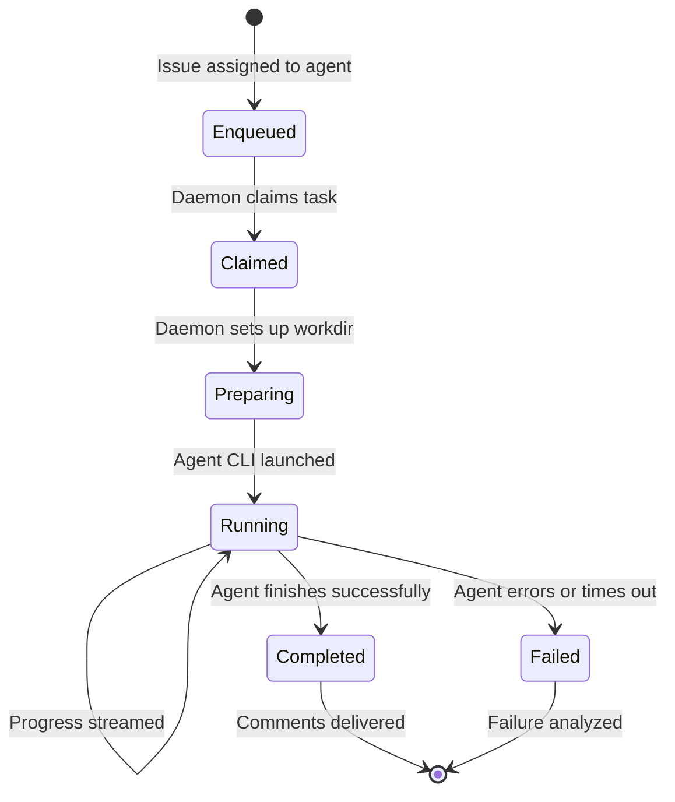

# Task Execution Workflow

This is the central workflow of Multica: how work assigned to an AI agent transitions from an issue on the board to completed code with delivered comments.

## Lifecycle Overview



## Step-by-Step Flow

### 1. Issue Assignment → Task Enqueue

When an issue is assigned to an agent (directly or through squad routing), the server creates a task entry in the agent task queue (`agent_task_queue` table). The task is in `enqueued` state.

Key code: `server/internal/service/task.go` — `EnqueueTask`, `server/internal/handler/issue.go` — assignment handler.

The server then sends a `TaskAvailable` WebSocket message to the target daemon through `daemonws.Hub`, hinting that work is available. The daemon still claims through the HTTP endpoint — the WS message is a wakeup, not a dispatch.

### 2. Daemon Claim

The daemon polls for available tasks or responds to the wakeup hint. It calls the claim endpoint, which atomically transitions the task to `claimed` state. The claim is workspace-scoped and authenticated with a daemon token.

Key code: `server/internal/handler/daemon.go` — claim handler, `server/internal/daemon/daemon.go` — claim logic.

The daemon implements capacity management:
- `taskSlotWaitTimeout` (2s): how long to wait for a free slot
- `taskSlotCapacityBackoff` (5s): cooldown between capacity checks

### 3. Task Preparation

Once claimed, the daemon prepares the execution environment:

1. **Repo setup**: Clones or updates the workspace repository to the configured workdir. Uses `repocache` for efficient re-use.
2. **Agent resolution**: Reads the agent record (model, thinking level, instructions, custom args, custom env, skills) from the server.
3. **Skill injection**: If skills are bound to the agent, the daemon fetches skill bundles and injects them into the agent's prompt.
4. **Auth token**: The server provides a task-scoped auth token so the agent can call Multica APIs during execution.

Key code: `server/internal/daemon/daemon.go` — `prepareTask`, `ensureRepoReady`.

### 4. Agent CLI Execution

The daemon launches the configured agent CLI as a child process. Multica supports 15+ agent backends, each wrapped by an adapter in `server/pkg/agent/`:

| Backend | Adapter File | Model Discovery |
|---------|-------------|-----------------|
| Claude Code | `claude.go` | `claude --version`, `--effort` levels |
| Codex (OpenAI) | `codex.go` | `codex debug models`, reasoning catalog |
| OpenCode | `opencode.go` | `opencode run --variant` |
| Cursor Agent | `cursor.go` | MCP config seeding |
| GitHub Copilot CLI | `copilot.go` | Version detection |
| CodeBuddy, Hermes, Pi, OpenClaw, Kimi, Kiro CLI, Antigravity, Qoder CLI, Trae CLI | Individual adapters | Each with CLI-specific version/model extraction |

**Model discovery** is dynamic and cached (60s TTL for models, 10min for thinking catalogs). The daemon shells out to each installed CLI to discover available models and their capabilities rather than hard-coding a list. This means newly installed agent updates are picked up automatically.

**Thinking/reasoning levels** are per-model and per-provider. Claude uses `--effort low|medium|high|xhigh|max`. Codex uses `model_reasoning_effort=none|minimal|low|medium|high|xhigh|max|ultra`. Values are passed directly to each CLI — there is no shared enum normalization, so what the user sees matches each CLI's own vocabulary.

Key code: `server/pkg/agent/models.go` — model discovery, `server/pkg/agent/thinking.go` — thinking catalog discovery.

### 5. Progress Streaming

As the agent executes, the daemon captures output and streams structured progress messages back to the server via WebSocket. Each message is a `TaskMessagePayload`:

```go
type TaskMessagePayload struct {
    TaskID    string         `json:"task_id"`
    IssueID   string         `json:"issue_id,omitempty"`
    Seq       int            `json:"seq"`
    Type      string         `json:"type"`    // "text", "tool_use", "tool_result", "error"
    Tool      string         `json:"tool,omitempty"`
    Content   string         `json:"content,omitempty"`
    Input     map[string]any `json:"input,omitempty"`
    Output    string         `json:"output,omitempty"`
}
```

The server relays these to web clients through `realtime.Hub`, allowing the UI to show live execution progress (tool calls, file edits, terminal output) in the issue detail view's execution log section.

Key code: `server/pkg/protocol/messages.go`, `server/internal/handler/daemon.go` — progress handler.

### 6. Completion and Comment Delivery

When the agent finishes, the daemon sends a `TaskCompleted` message with the PR URL and output. The server:

1. Transitions the task to `completed` (or `failed`)
2. **Coalesces comments**: Agent execution messages are merged into deliverable comments. The coalesced comment delivery system (`coalesced-comments-v1` capability, added in `bf161f2f9`) preserves the merged comment structure — the daemon now reports comments as coalesced groups, and the server delivers them atomically.
3. Posts comments on the issue with the agent's findings, PR link, and any generated output
4. Updates the issue status based on agent results
5. Broadcasts updates to all connected clients via realtime

Key code: `server/internal/handler/comment.go` — `ReconcileComments`, `server/internal/handler/daemon_comment_delivery_test.go`.

### 7. Failure Handling

If the agent fails (crash, timeout, error exit code), the server:
- Transitions the task to `failed`
- Runs failure analysis through `server/pkg/taskfailure/`
- Posts a failure comment on the issue with diagnostic information
- The issue remains assigned so it can be retried or reassigned

Recent fix `521052a00` added recovery for stale Claude resume sessions — if the Claude process becomes unresponsive, the daemon can now detect and restart it.

## WebSocket Wire Protocol

Communication between daemon and server uses a typed message envelope:

```go
type Message struct {
    Type    string          `json:"type"`
    Payload json.RawMessage `json:"payload"`
}
```

Key message types:
- `DaemonRegister` (daemon → server): registers available runtimes
- `TaskAvailable` (server → daemon): wakeup hint
- `TaskDispatch` (server → daemon): full task assignment
- `TaskProgress` (daemon → server): execution progress
- `TaskCompleted` (daemon → server): completion with PR URL
- `RuntimeProfilesChanged` (server → daemon): profile drift notification

Key code: `server/pkg/protocol/messages.go`, `server/internal/handler/daemon_ws.go`.

## Related Concepts

- [Agents and Runtimes](../domain/agents-and-runtimes.md) — how agents are configured and runtimes are managed
- [Issues and Collaboration](../domain/issues-and-collaboration.md) — how issues trigger tasks and comments are delivered
- [Architecture Overview](../architecture/overview.md) — how the daemon WebSocket hub fits into the system
